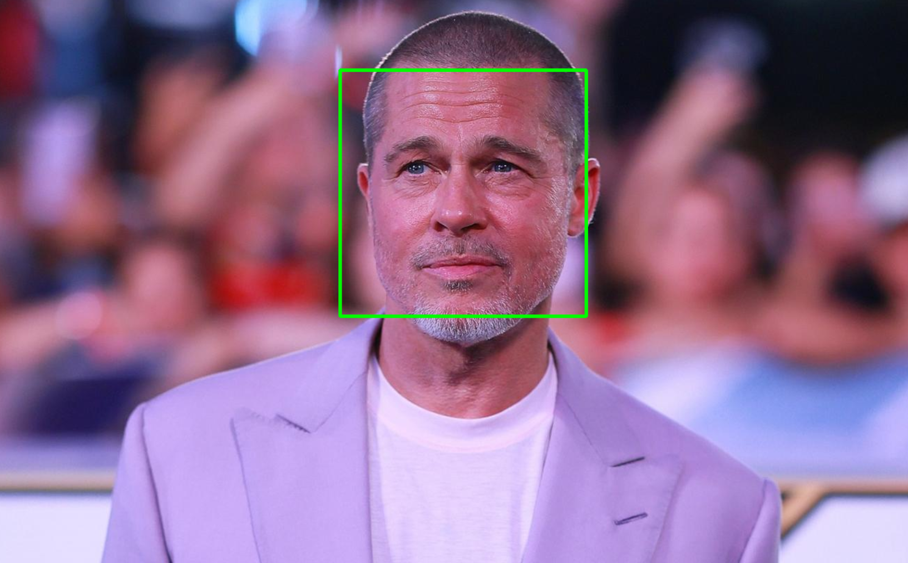

# Yüz Tanıma Projesi

Bu proje, OpenCV kütüphanesi ve Haar Cascade sınıflandırıcıları kullanılarak geliştirilmiş basit bir yüz tanıma uygulamasıdır.



## Özellikler

- Görüntülerde yüz tespiti
- Tespit edilen yüzlerin dikdörtgenlerle işaretlenmesi
- Basit ve anlaşılır Python kodu
- Haar Cascade önceden eğitilmiş model kullanımı

## Nasıl Çalışır?

Proje, OpenCV'nin sağladığı önceden eğitilmiş Haar Cascade sınıflandırıcıyı kullanarak görüntülerdeki yüzleri tespit eder. İşlem adımları:

1. Görüntü yüklenir ve gri tonlamaya dönüştürülür
2. Haar Cascade sınıflandırıcı kullanılarak yüzler tespit edilir
3. Tespit edilen her yüz yeşil bir dikdörtgenle işaretlenir
4. Sonuç görüntüsü ekranda gösterilir

## Kurulum

### Gereksinimler

- Python 3.x
- OpenCV kütüphanesi

### Kurulum Adımları

1. Projeyi klonlayın:
```bash
git clone https://github.com/BarisPY/FaceDetect
```
```bash
cd FaceDetection
```


2. Gerekli kütüphaneleri yükleyin:

```bash
pip install opencv-python
```


3. haarcascade_frontalface_default.xml dosyasının proje dizininde olduğundan emin olun


## Kullanım
Yüz tespiti yapmak istediğiniz görüntüyü proje dizinine koyun (varsayılan: a.jpg)

Terminalde aşağıdaki komutu çalıştırın:

```bash
python facdetection.py
```
Program çalıştığında, yüzlerin tespit edildiği görüntüyü göreceksiniz.


## Farklı Görüntü Kullanımı
Farklı bir görüntü kullanmak için facdetection.py dosyasındaki image_path değişkenini düzenleyin:

```bash
image_path = "yeni_gorsel.jpg"
```


## Örnek Çıktılar

Before (Önce)


After (Sonra)


## İletişim
Sorularınız veya önerileriniz için:
- Barış Değerli - [celikbaris263@gmail.com]

- Proje Linki: [https://github.com/BarisPY/FaceDetect]
